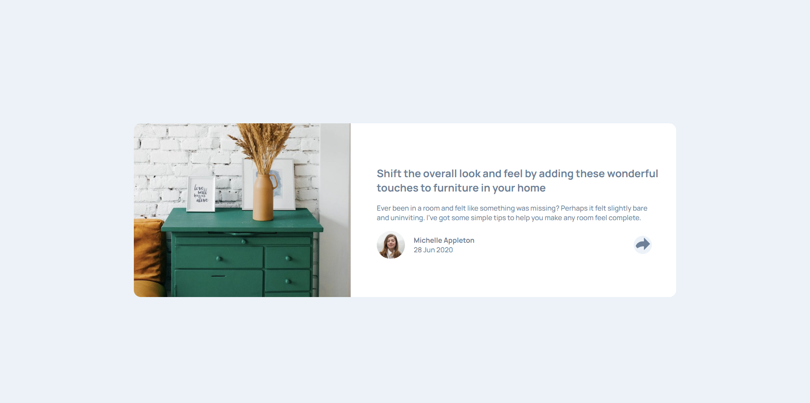

# Frontend Mentor - Article preview component solution

This is a solution to the [Article preview component challenge on Frontend Mentor](https://www.frontendmentor.io/challenges/article-preview-component-dYBN_pYFT). Frontend Mentor challenges help you improve your coding skills by building realistic projects.

## Table of contents

- [Overview](#overview)
  - [The challenge](#the-challenge)
  - [Screenshot](#screenshot)
  - [Links](#links)
- [My process](#my-process)
  - [Built with](#built-with)
  - [What I learned](#what-i-learned)
  - [Continued development](#continued-development)
  - [Useful resources](#useful-resources)
  - [AI Collaboration](#ai-collaboration)
- [Author](#author)

**Note: Delete this note and update the table of contents based on what sections you keep.**

## Overview

### The challenge

Users should be able to:

- View the optimal layout for the component depending on their device's screen size
- See the social media share links when they click the share icon

### Screenshot

### Links

- [Github repository](https://github.com/IlPiova/frontendmaster/tree/main/article-preview-component-master)
- [Live site](https://fementor-articlecomponentproject.netlify.app)

## My process

### Built with

- Semantic HTML5 markup
- CSS custom properties
- Flexbox
- Mobile-first workflow
- Vanilla JS

### What I learned

Use this section to recap over some of your major learnings while working through this project. Writing these out and providing code samples of areas you want to highlight is a great way to reinforce your own knowledge.

### Continued development

I need to improve a lot when it comes to managing the positioning of elements in CSS. In this case, I got round the problem by calculating the ideal position for the share pop-up using the coordinates obtained from JS, but I’d like to be able to do this directly in CSS.

Also, I need to sort out the resizing of the mobile card when the share menu appears.

### Useful resources

- [javascript.info](https://javascript.info/coordinates) - To undestand how to obtain elemnt's coordinates

### AI Collaboration

I used Claude Chat because, once the work was complete and the site had fully loaded, the card would shift to the other side. After testing a few theories (fonts and images), we came to the conclusion that it was a scroll restoration issue, which did not occur when the project was opened in an incognito window.

## Author

- Website - [My portfolio](https://cristian-piovani-portfolio.netlify.app)
- Frontend Mentor - [@IlPiova](https://www.frontendmentor.io/profile/IlPiova)
- GitHub Profile - [here](https://github.com/IlPiova/)
