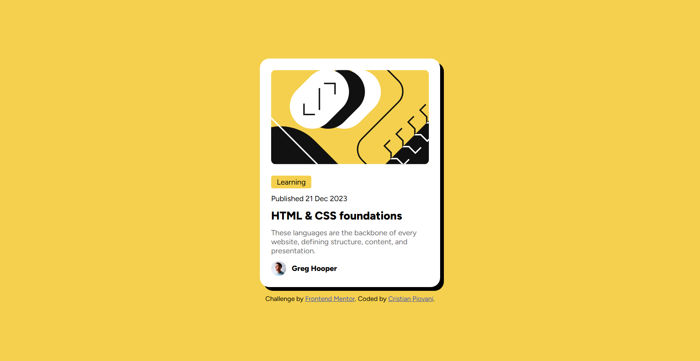

# Frontend Mentor - Blog preview card solution

This is my solution to the [Blog preview card challenge on Frontend Mentor](https://www.frontendmentor.io/challenges/blog-preview-card-ckPaj01IcS).

## Table of contents

- [Overview](#overview)
  - [The challenge](#the-challenge)
  - [Screenshot](#screenshot)
  - [Links](#links)
- [My process](#my-process)
  - [Built with](#built-with)
  - [What I learned](#what-i-learned)
  - [Continued development](#continued-development)
- [Author](#author)

## Overview

### The challenge

Users should be able to:

- See hover and focus states for all interactive elements on the page

### Screenshot

### Links

- Solution URL: [Add solution URL here](https://your-solution-url.com)
- Live Site URL: [Add live site URL here](https://your-live-site-url.com)

## My process

### Built with

- Semantic HTML5 markup
- CSS
- Flexbox

### What I learned

This exercise was essential for me in understanding how to structure HTML code: how to group the various elements of the website into sections or divs, and how to make better use of the `<section>` tag.

I also practised resizing images and using media queries.

### Continued development

I have significant gaps in my knowledge of responsive web design; I need to understand how to set up CSS and media queries correctly, as well as start applying the ‘mobile-first’ approach.

For this reason, I plan to revisit this project later and restructure the stylesheet.

## Author

- Website - [My portfolio](https://cristian-piovani-portfolio.netlify.app)
- Frontend Mentor - [@IlPiova](https://www.frontendmentor.io/profile/IlPiova)
