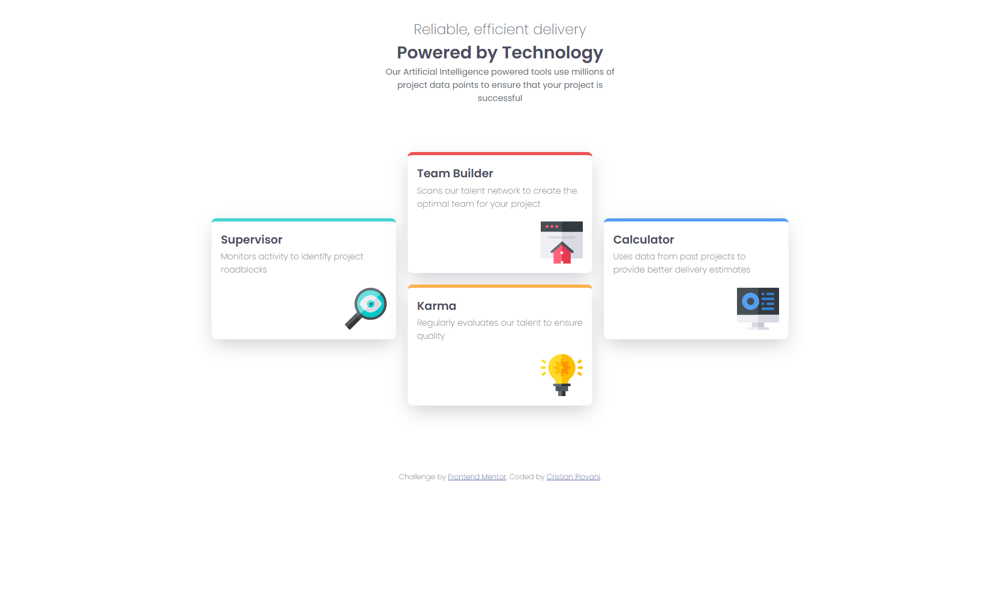

# Frontend Mentor - Four card feature section solution

This is a solution to the [Four card feature section challenge on Frontend Mentor](https://www.frontendmentor.io/challenges/four-card-feature-section-weK1eFYK). Frontend Mentor challenges help you improve your coding skills by building realistic projects.

## Table of contents

- [Overview](#overview)
  - [The challenge](#the-challenge)
  - [Screenshot](#screenshot)
  - [Links](#links)
- [My process](#my-process)
  - [Built with](#built-with)
  - [What I learned](#what-i-learned)
  - [Continued development](#continued-development)
  - [Useful resources](#useful-resources)
- [Author](#author)

## Overview

### The challenge

Users should be able to:

- View the optimal layout for the site depending on their device's screen size

### Screenshot

### Links

- [GitHub Repository](https://github.com/IlPiova/frontendmaster/tree/main/four-card-feature-section-master)
- [Live site](https://frontendmentor-fourcardproject.netlify.app)

## My process

### Built with

- Semantic HTML5 markup
- CSS custom properties
- Flexbox
- CSS Grid
- CSS Flexbox
- Mobile-first workflow

### What I learned

Initially, I set myself the goal of not using media queries: I tried using Flexbox and its `wrap` property, but it didn’t work; similarly, CSS Grid didn’t help either. I therefore decided to consult Gemini about what I could do, asking them not to give me the solution outright but to help me work it out for myself. What you see here, with a total of two media queries, is the result.

### Continued development

It really does take a lot of practice, whether you’re using grid or flexbox. I thought I’d got a pretty good grasp of them, but when it comes to putting them into practice, I’m far from feeling completely confident.

### Useful resources

- [An Interactive Guide to Flexbox](https://www.joshwcomeau.com/css/interactive-guide-to-flexbox/)
- [An Interactive Guide to CSS Grid](https://www.joshwcomeau.com/css/interactive-guide-to-grid/)

## Author

- Website - [My portfolio](https://cristian-piovani-portfolio.netlify.app)
- Frontend Mentor - [@IlPiova](https://www.frontendmentor.io/profile/IlPiova)
- GitHub Profile - [here](https://github.com/IlPiova/)
