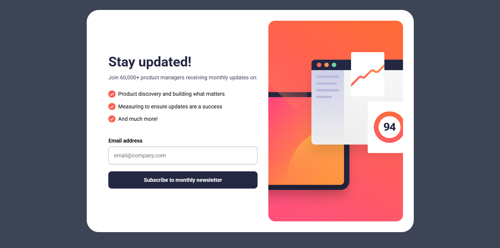

# Frontend Mentor - Newsletter sign-up form with success message solution

This is a solution to the [Newsletter sign-up form with success message challenge on Frontend Mentor](https://www.frontendmentor.io/challenges/newsletter-signup-form-with-success-message-3FC1AZbNrv). Frontend Mentor challenges help you improve your coding skills by building realistic projects.

## Table of contents

- [Overview](#overview)
  - [The challenge](#the-challenge)
  - [Screenshot](#screenshot)
  - [Links](#links)
- [My process](#my-process)
  - [Built with](#built-with)
  - [What I learned](#what-i-learned)
  - [Continued development](#continued-development)
  - [Useful resources](#useful-resources)
- [Author](#author)

**Note: Delete this note and update the table of contents based on what sections you keep.**

## Overview

### The challenge

Users should be able to:

- Add their email and submit the form
- See a success message with their email after successfully submitting the form
- See form validation messages if:
  - The field is left empty
  - The email address is not formatted correctly
- View the optimal layout for the interface depending on their device's screen size
- See hover and focus states for all interactive elements on the page

### Screenshot

### Links

- [Github repository](https://github.com/IlPiova/frontendmaster/tree/main/newsletter-sign-up-with-success-message-main)
- [Live site](https://fementor-newslettersignup.netlify.app)

## My process

### Built with

- Semantic HTML5 markup
- CSS custom properties
- Flexbox
- Mobile-first workflow
- Vanilla JS

### What I learned

I’ve learnt how to handle form submissions, which has also given me some ideas about React – something I’ll be getting back to soon.

### Continued development

I need to improve my handling of the form object, but it didn’t take me very long to develop this project

### Useful resources

- [javascript.info](https://javascript.info/document)

## Author

- Website - [My portfolio](https://cristian-piovani-portfolio.netlify.app)
- Frontend Mentor - [@IlPiova](https://www.frontendmentor.io/profile/IlPiova)
- GitHub Profile - [here](https://github.com/IlPiova/)
