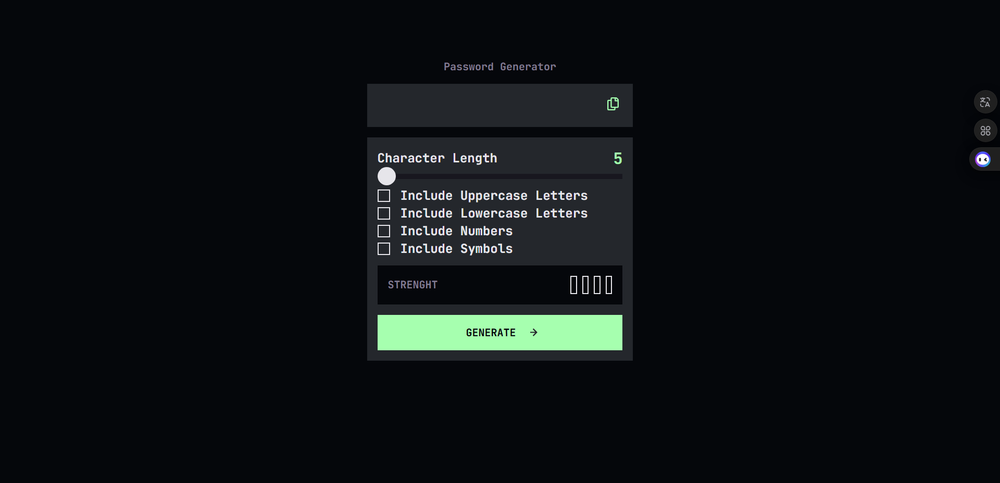

# Frontend Mentor - Password generator app solution

This is a solution to the [Password generator app challenge on Frontend Mentor](https://www.frontendmentor.io/challenges/password-generator-app-Mr8CLycqjh). Frontend Mentor challenges help you improve your coding skills by building realistic projects.

## Table of contents

- [Overview](#overview)
  - [The challenge](#the-challenge)
  - [Screenshot](#screenshot)
  - [Links](#links)
- [My process](#my-process)
  - [Built with](#built-with)
  - [What I learned](#what-i-learned)
  - [Continued development](#continued-development)
  - [AI Collaboration](#ai-collaboration)
- [Author](#author)

## Overview

### The challenge

Users should be able to:

- Generate a password based on the selected inclusion options
- Copy the generated password to the computer's clipboard
- See a strength rating for their generated password
- View the optimal layout for the interface depending on their device's screen size
- See hover and focus states for all interactive elements on the page

### Screenshot

### Links

- [Github Repository](https://github.com/IlPiova/frontendmaster/tree/main/password-generator-app)
- [Live Site](https://fementor-passwordgeneratorproject.netlify.app)

## My process

### Built with

- Semantic HTML5 markup
- CSS custom properties
- Flexbox
- Mobile-first workflow

### What I learned

The two most important achievements were the styling of the input range and the use/discovery of the Fisher-Yates algorithm

### Continued development

I definitely need to improve my use of timers and, more generally, gain a deeper understanding of CSS properties for each individual browser.

### AI Collaboration

I used Claude as a tutor, asking him never to give me the solution directly but to guide me towards it by getting me to think through my code

## Author

- Website - [My portfolio](https://cristian-piovani-portfolio.netlify.app)
- Frontend Mentor - [@IlPiova](https://www.frontendmentor.io/profile/IlPiova)
- GitHub Profile - [here](https://github.com/IlPiova/)
