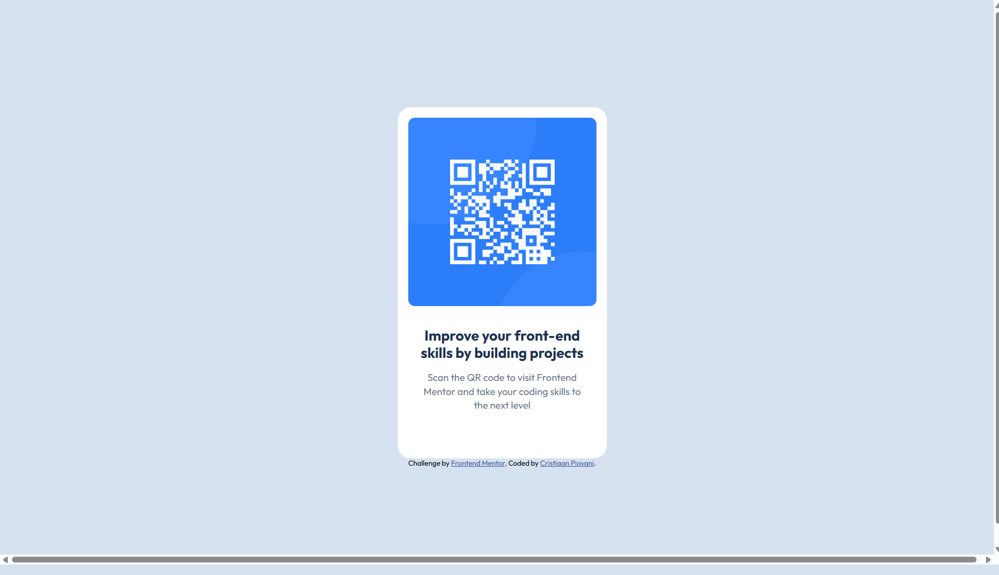

# Frontend Mentor - QR code component solution

This is a solution to the [QR code component challenge on Frontend Mentor](https://www.frontendmentor.io/challenges/qr-code-component-iux_sIO_H). Frontend Mentor challenges help you improve your coding skills by building realistic projects.

## Table of contents

- [Overview](#overview)
  - [Screenshot](#screenshot)
  - [Links](#links)
- [My process](#my-process)
  - [Built with](#built-with)
  - [What I learned](#what-i-learned)
  - [Continued development](#continued-development)
  - [Useful resources](#useful-resources)
- [Author](#author)

## Overview

### Screenshot

### Links

- Solution URL: [Add solution URL here](https://github.com/IlPiova/frontendmaster/tree/main/qr-code-component-main)
- Live Site URL: [Add live site URL here](https://frontendmaster-qrcodeproject.netlify.app)

## My process

### Built with

- Semantic HTML5 markup
- CSS
- Flexbox

### What I learned

This is one of my first approaches to **Semantic HTML**, and it makes it simpler to organize the document's structure. Also, I understood the differences between `box-sizing: border-box;` and `box-sizing: content-box`; thanks to the suggested resources.

### Continued development

The most difficult part at the moment is managing image sizes, so now I'm going to try to figure them out.

### Useful resources

- [Web.dev Semantic HTML](https://web.dev/learn/html/semantic-html?hl=it)
- [Web.dev box model](https://web.dev/learn/css/box-model?hl=it)

## Author

- Website - [My portfolio](https://cristian-piovani-portfolio.netlify.app)
- Frontend Mentor - [@IlPiova](https://www.frontendmentor.io/profile/IlPiova)
