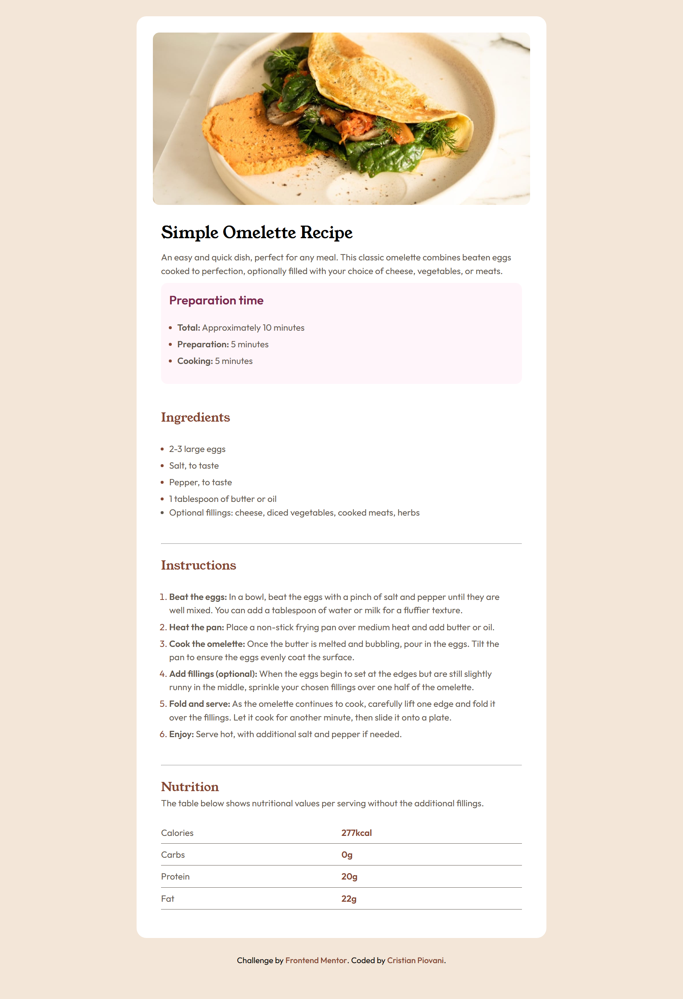

# Frontend Mentor - Recipe page solution

This is a solution to the [Recipe page challenge on Frontend Mentor](https://www.frontendmentor.io/challenges/recipe-page-KiTsR8QQKm). Frontend Mentor challenges help you improve your coding skills by building realistic projects.

## Table of contents

- [Overview](#overview)
  - [The challenge](#the-challenge)
  - [Screenshot](#screenshot)
  - [Links](#links)
- [My process](#my-process)
  - [Built with](#built-with)
  - [What I learned](#what-i-learned)
  - [Continued development](#continued-development)
  - [Useful resources](#useful-resources)
  - [AI Collaboration](#ai-collaboration)
- [Author](#author)

## Overview

### Screenshot

### Links

- Solution URL: [Add solution URL here](https://github.com/IlPiova/frontendmaster/tree/main/recipe-page-main)
- Live Site URL: [Add live site URL here](https://frontendmentor-recipepage-project.netlify.app)

## My process

### Built with

- Semantic HTML5 markup
- CSS custom properties
- Flexbox
- Mobile-first workflow

### What I learned

For the first time, **it came naturally to me how to organise the development of the website**, particularly the style sheet: I followed an order from the most general selector to the most specific, adhering to the HTML structure.

I also managed to focus on the **mobile version first**, and then on the desktop version.

Both of these factors meant that development took **much less time** and caused **far less stress** than usual.

Another small success was using **HTML tables**: I’ve always avoided them because I never fully understood them, but now I know I can work on them with the right amount of effort.

### Continued development

The main issues were with the styling of the lists and the table; I will try to pay particular attention to these two elements in future projects.

### Useful resources

- [HTML Tabes by web.dev](https://web.dev/learn/html/tables?hl=it#table_elements_in_order)

### Ai collaboration

I used Gemini to work out how to style the lists and the table.

## Author

- Website - [My portfolio](https://cristian-piovani-portfolio.netlify.app)
- Frontend Mentor - [@IlPiova](https://www.frontendmentor.io/profile/IlPiova)
