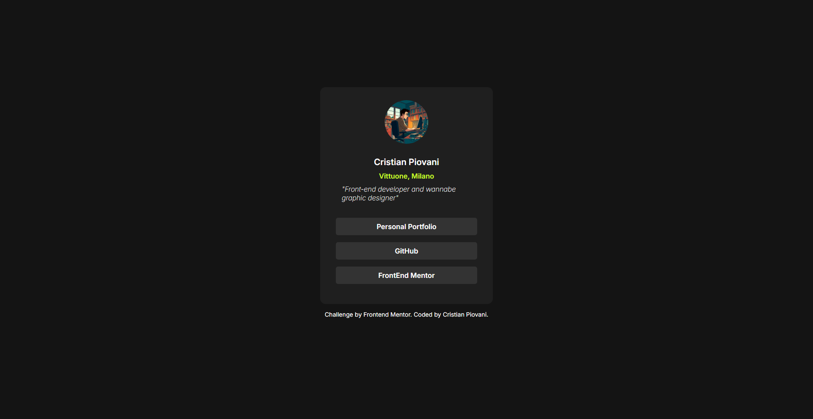

# Frontend Mentor - Social links profile solution

This is a solution to the [Social links profile challenge on Frontend Mentor](https://www.frontendmentor.io/challenges/social-links-profile-UG32l9m6dQ). Frontend Mentor challenges help you improve your coding skills by building realistic projects.

## Table of contents

- [Overview](#overview)
  - [The challenge](#the-challenge)
  - [Screenshot](#screenshot)
  - [Links](#links)
- [My process](#my-process)
  - [Built with](#built-with)
  - [What I learned](#what-i-learned)
  - [Continued development](#continued-development)
- [Author](#author)

## Overview

### The challenge

Users should be able to:

- See hover and focus states for all interactive elements on the page

### Screenshot



### Links

- Solution URL: [Repository](https://github.com/IlPiova/frontendmaster/tree/main/social-links-profile-main)
- Live Site URL: [Live site](https://frontmentor-sociallinks-project.netlify.app)

## My process

### Built with

- Semantic HTML5 markup
- CSS custom properties
- Flexbox
- CSS Grid

### What I learned

This was my first time using CSS custom properties; fortunately, having already used SCSS, I found them easy to use, but I think I can do better. I’ve switched to using `rem` for text sizes, so as not to cause any issues with zooming.

```css
:root {
  /* color variables */
  --green: hsl(75, 94%, 57%);
  --white: hsl(0, 0%, 100%);
  --light-grey: hsl(0, 0%, 20%);
  --grey: hsl(0, 0%, 12%);
  --dark-grey: hsl(0, 0%, 8%);

  /* font variables */
  --text-size: 0.8rem;
}
```

## Usefull sites

- [pixel to rem converter](https://nekocalc.com/px-to-rem-converter)

## Author

- Website - [My portfolio](https://cristian-piovani-portfolio.netlify.app)
- Frontend Mentor - [@IlPiova](https://www.frontendmentor.io/profile/IlPiova)
